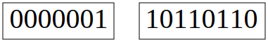
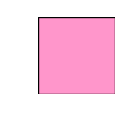

# Języki skryptowe - Python
## Wykład 2

---

* sekwencyjne typy danych
* system binarny i szesnastkowy
* wyrażenia logiczne

## Ostatnio

---

* wprowadzone zostały 4 typy zmiennych: *int*, *float*, *complex* i *str*


```python
# [zmienna] [operator przypisania] [wartość]
# typowanie dynamiczne

n = 10  # liczba całkowita
x = 1.5 # liczba zmiennoprzecinkowa
c = 2j  # liczba zespolona

s = "Python" # łańcuch znaków
```

## Łańuch znaków

---

* zmienna *str* przechowuje tak naprawdę ciąg znaków
* w którym każdy znak ma określoną pozycję


```python
s = "Python"

s[0] # str[i] -> i-ty znak w ciągu
```


    'P'


```python
s[1] # pierwszy to drugi?
```


    'y'


```python
s[2]
```


    't'


## Indeksowanie

---

* indeksowanie zaczyna się od 0 a kończy na *n-1*, gdzie *n* - długość ciągu


```python
s = "Python"

n = len(s) # długość łańcucha s

print(n)
```

    6


```python
s[n-1] # ostatni element
```


    'n'


```python
s[n] # poza zakresem
```


    ---------------------------------------------------------------------------

    IndexError                                Traceback (most recent call last)

    <ipython-input-7-1dea7ae0782c> in <module>()
    ----> 1 s[n] # poza zakresem
    

    IndexError: string index out of range


## Wycinki

---


```python
s = "Python"

s[2:4] # elementy od 2 do 3 (czyli "od 3 do 4")
```


    'th'


```python
s[2:] # od indeksu 2 do końca
```


    'thon'


```python
s[:2] # od początku do 1
```


    'Py'


```python
s[2:1000] # nie ma błędu o wyjściu poza zakres
```


    'thon'


## Wycinki z krokiem

---


```python
s = "0123456789"

s[2:8:2] # sekwencja[początek:koniec:krok]
```


    '246'


```python
s[2::3] # od 2 do końca co 3
```


    '258'


```python
s[::2] # od początu do końca co 2
```


    '02468'


## Indeksy ujemne

---

* indeks $-k$ oznacza $n-k$, gdzie $n$ - długość łańcucha


```python
s = "Python"

s[-1] # 6 - 1 = 5 -> ostatni znak
```


    'n'


```python
s[-2] # 6 - 2 = 4 -> przedostatni
```


    'o'


```python
s[-2:] # od 4 do końca -> dwa ostatnie
```


    'on'


```python
s[:-2] # wszystko oprócz dwóch ostatnich
```


    'Pyth'


## Dygresja o klasach

---

* więcej o klasach będzie na dalszych wykładach
* klasa definuje obiekt
* przypisując wartość zmiennej tworzymy obiekt danej klasy


```python
n = 10 # tworzymy obiekt klasy int
```

## Dygresja o klasach

---

* klasa może posiadać zmienne i metody (czyli funkcje działające na obiekt)


```python
x = 1.0 # tworzymy obiekt klasy float

# metody/zmienne klasy wywołujemy .
x.is_integer() # [obiekt].metoda
```


    True


```python
s = "Python" # tworzymy obiekt klasy str

s.replace('yt', 'yyyyyt') # [obiekt].metoda
```


    'Pyyyyython'


## Lista (*list*)

---

* sekwencja zmiennych dowolnego typu
* dynamiczny rozmiar
* inicjowana jest:
    * nawiasy kwadratowe
    * jawnie *list([iterable])* (czyli konstruktor klasy *list*)
    * lista składana (*list comprehension*)

## Lista przez [ ]

---


```python
lista = [1, 2, 'a', "Python"]
```


```python
len(lista) # długość listy
```


    4


```python
lista[0] # pierwszy element listy
```


    1


```python
lista[-1] # ostatni element listy
```


    'Python'


## Lista przez konstruktor

---


```python
lista = list([1,2,3]) # bez sensu, ale można

print(lista)
```

    [1, 2, 3]


```python
lista = list("Python") # można stworzyć listę ze string

print(lista)
```

    ['P', 'y', 't', 'h', 'o', 'n']


```python
lista = list(1) # ale już nie z int
```


    ---------------------------------------------------------------------------

    TypeError                                 Traceback (most recent call last)

    <ipython-input-28-5b92e1b521a9> in <module>()
    ----> 1 lista = list(1) # ale już nie z int
    

    TypeError: 'int' object is not iterable


## Lista składana

---


```python
cyfry = ["jeden", "dwa", "trzy"] # definiujemy listę

# [wartość] dla [obiektu] z [listy]
# pętle zostaną szerzej omówione na kolejnych wykładach
dlugosc = [len(cyfra) for cyfra in cyfry]

print(dlugosc)
```

    [5, 3, 4]


```python
cyfry = ["jeden", "dwa", "trzy"] # definiujemy listę

# [wartość] dla [obiektu] z [listy] jeśli [warunek]
# warunki zostaną szerzej omówione pod koniec wykładu
dlugosc = [len(cyfra) for cyfra in cyfry if cyfra != 'dwa']

print(dlugosc)
```

    [5, 4]


## Lista jako rezultat funkcji

---


```python
help(str.split)
```

    Help on method_descriptor:
    
    split(...)
        S.split(sep=None, maxsplit=-1) -> list of strings
        
        Return a list of the words in S, using sep as the
        delimiter string.  If maxsplit is given, at most maxsplit
        splits are done. If sep is not specified or is None, any
        whitespace string is a separator and empty strings are
        removed from the result.
    


```python
("Python is awesome, fast, and friendly!").split()
```


    ['Python', 'is', 'awesome,', 'fast,', 'and', 'friendly!']


```python
("Python is awesome, fast, and friendly!").split(',')
```


    ['Python is awesome', ' fast', ' and friendly!']


## Krotka (*tuple*)

---

* sekwencja zmiennych dowolnego typu
* stały rozmiar
* inicjowana jest:
    * nawiasy okrągłe
    * ciąg elementów oddzielonych przecinkiem
    * jawnie *tuple([iterable])*

## Krotka

---


```python
krotka = (1, 2, 3, "Python") # jak lista, ale () zamiast []

print(krotka)
```

    (1, 2, 3, 'Python')


```python
krotka = 1, 2, 3, "Python" # brak nawiasów = tuple

print(krotka)
```

    (1, 2, 3, 'Python')


```python
lista = list("Python") # lista ze stringa

krotka = tuple(lista)  # krotka z listy

print(lista)
print(krotka)
```

    ['P', 'y', 't', 'h', 'o', 'n']
    ('P', 'y', 't', 'h', 'o', 'n')


## Lista vs Krotka

---

* krotka ma stały rozmiar a lista jest dynamiczna
* krotka jest "niezmienna" (*immutable*) w przeciwieństwie do listy (*mutable*)
* więcej o *mutable* vs *immutable* w dalszej części wykładu
* jeśli sekwencja obiektów jest stała w czasie działania programu, lepiej używać krotek
    * szybsze
    * bezpieczniejsze
    * mogą być kluczami w słowniku *(o słownikach na kolejnych wykładach)*

## Lista vs Krotka

---


```python
lista = [1, 2, 3]

print(lista)

lista[0] = 2

print(lista)
```

    [1, 2, 3]
    [2, 2, 3]


```python
krotka = (1, 2, 3)

krotka[0] = 2
```


    ---------------------------------------------------------------------------

    TypeError                                 Traceback (most recent call last)

    <ipython-input-38-9a057d2d95b0> in <module>()
          1 krotka = (1, 2, 3)
          2 
    ----> 3 krotka[0] = 2
    

    TypeError: 'tuple' object does not support item assignment


## Range

---

* uwaga: w Pythonie 2 *range()* jest funkcją wbudowaną; w Pythonie 3 jest to typ danych (klasa)
* reprezentuje (niezmienniczą) sekwencję liczb
* zajmuje mniej pamięci niż *list* lub *tuple* (przechowuje tylko informację o początku, końcu i kroku)

## Range

---


```python
x = range(10) # od 0 do 10

print(x) # w Pythonie 2 zobaczylibyśmy [0, 1, 2, 3, 4, 5, 6, 7, 8, 9]
```

    range(0, 10)


```python
print(list(x)) # zrzutujemy na listę, żeby wydrukować
```

    [0, 1, 2, 3, 4, 5, 6, 7, 8, 9]


```python
x[0] = 1 # range jest immutable
```


    ---------------------------------------------------------------------------

    TypeError                                 Traceback (most recent call last)

    <ipython-input-41-3a9de573c036> in <module>()
    ----> 1 x[0] = 1 # range jest immutable
    

    TypeError: 'range' object does not support item assignment


## Range

---


```python
cyfry = range(0, 10)       # range(początek = 0, koniec) 
parzyste = range(2, 10, 2) # range(początek, koniec, krok)
nieparzyste = range(1, 10, 2)

print(list(cyfry))
print(list(parzyste))
print(list(nieparzyste))
```

    [0, 1, 2, 3, 4, 5, 6, 7, 8, 9]
    [2, 4, 6, 8]
    [1, 3, 5, 7, 9]


## Sekwencyjne typy danych

---

* *list* - dynamiczny ciąg zmiennych dowolnego typu
* *tuple* - niezmienniczy ciąg zmiennych dowolnego typu
* *range* - niezmienniczy ciąg liczba całkowitych
* *str* - niezmienniczy ciąg znaków
* (dla kompletności) są jeszcze binarne sekwencyjne typy danych: *bytes*, *bytearray*, *memoryview*


## Operacje na sekwencjach

---

* *in* - prawda jeśli element należy do sekwencji, inaczej fałsz
* *not in* - fałsz jeśli element należy do sekwencji, inaczej prawda


```python
s = "Python"

"y" in s
```


    True


```python
"p" not in s
```


    True


* więcej o prawdzie i fałszu w dalszej części wykładu

## Operacje na sekwencjach

---

* splot (*concatenation*)
* nie dla *range*


```python
begin = "Python "
middle = "is "
end = "awesome!"

begin + middle + end
```


    'Python is awesome!'


```python
lista = [1, 2, 3, 4]
dodatek = [5, 6, 7, 8]

dodatek + lista # kolejność ma znaczenie
```


    [5, 6, 7, 8, 1, 2, 3, 4]


## Operacje na sekwencjach

---

* mnożenie przez liczbę calkowitą
* nie dla *range*


```python
znak = '-'

znak * 10
```


    '----------'


```python
krotka = (1, 2, 3)

2 * krotka
```


    (1, 2, 3, 1, 2, 3)


## Operacje na sekwencjach

---

* wycinki


```python
lista = [1, 2, 3, "Python"]

lista[:2] # dwa pierwsze
```


    [1, 2]


```python
lista[3][-2:] # dwa ostatnie ostatniego
```


    'on'


```python
range(3, 15, 3)[:2] # dla range też działa
```


    range(3, 9, 3)


## Funkcje wbudowane dla sekwencji

---

* *len* - długość sekwencji
* *min*, *max* - najmniejszy, największy element


```python
len([1,2,-3]) # liczba elementów
```


    3


```python
min([1,2,-3]) # minimum
```


    -3


```python
max("Python") # maximum
```


    'y'


## Wspólne funkcje klasowe sekwencji

---

* *index* - indeks pierwszego znalezionego elementu
* *count* - ilość wystąpień elementu


```python
x = [1, 2, 3, 4, 5] * 2

print(x)
```

    [1, 2, 3, 4, 5, 1, 2, 3, 4, 5]


```python
x.count(4) # liczba 4 pojawia się 2 razy
```


    2


```python
x.index(4) # pierwszy raz dla i=3
```


    3


## Operacje na sekwencjach "zmiennych" (*mutable*)

---

* na razie znamy: *list*
* ale na kolejnych wykładach poznamy kolejne
* sekwencje "niezmienne" (*immutable*): *tuple*, *range* i *str*
* ale na kolejnych wykładach poznamy kolejne
* więcej o *mutable* vs *immutable* w dalszej części wykładu

## Operacje na sekwencjach "zmiennych" (*mutable*)

---


```python
lista = [1, 2, 3]

lista[1] = 4 # zamień wartość drugiego elementu

print(lista)
```

    [1, 4, 3]


```python
lista = [1, 2, 3]

lista[1:2] = [5, 5] # zamień wycinek

print(lista)
```

    [1, 5, 5, 3]


## Operacje na sekwencjach "zmiennych" (*mutable*)

---


```python
lista = [1, 2, 3]

del lista[1:2] # usuń wycinek

print(lista)
```

    [1, 3]


```python
lista = list(range(10))

del lista[::2] # usuń co drugi element

print(lista)
```

    [1, 3, 5, 7, 9]


## Funkcje klasowe sekwencji "zmiennych" (*mutable*)

---


```python
lista = [1, 2, 3, 4, 5]

lista.append(6) # append dodaje element na koniec listy

print(lista)

lista.append([7, 8, 9]) # lista dodana jako element

print(lista)
```

    [1, 2, 3, 4, 5, 6]
    [1, 2, 3, 4, 5, 6, [7, 8, 9]]


```python
lista = [1, 2, 3, 4, 5]

lista.extend([6, 7, 8, 9]) # extend rozwija listę 

print(lista)
```

    [1, 2, 3, 4, 5, 6, 7, 8, 9]


## Funkcje klasowe sekwencji "zmiennych" (*mutable*)

---


```python
lista = [1, 2, 3]

lista.clear() # usuwa wszystkie elementy

print(lista)
```

    []


```python
lista = [1, 2, 3]

kopia = lista.copy() # kopiuje całą listę

print(kopia)
```

    [1, 2, 3]


## Funkcje klasowe sekwencji "zmiennych" (*mutable*)

---


```python
lista = [1, 2, 3]

lista.insert(1, 4) # wstaw 4 pod indeks 2

print(lista)
```

    [1, 4, 2, 3]


```python
lista = [1, 2, 3]

lista.pop(1) # zwróć i usuń *i*-ty element
```


    2


```python
print(lista)
```

    [1, 3]


## Funkcje klasowe sekwencji "zmiennych" (*mutable*)

---


```python
lista = ['a', 'b', 3] * 3

print(lista)

lista.remove('b') # usuń element (pierwsze wystąpienie)

print(lista)
```

    ['a', 'b', 3, 'a', 'b', 3, 'a', 'b', 3]
    ['a', 3, 'a', 'b', 3, 'a', 'b', 3]


```python
lista = [1, 2, 3]

lista.reverse() # odwróć kolejność

print(lista)
```

    [3, 2, 1]


## Funkcja *sort* - tylko dla list


```python
help(list.sort)
```

    Help on method_descriptor:
    
    sort(...)
        L.sort(key=None, reverse=False) -> None -- stable sort *IN PLACE*
    


```python
lista = ['e', 'D', 'a', 'b', 'C']

lista.sort() # sortuj 

print(lista)

lista.sort(key=str.lower) # sortuj wg funkcji key

print(lista)
```

    ['C', 'D', 'a', 'b', 'e']
    ['a', 'b', 'C', 'D', 'e']


## System dziesiętny

---

* ogólnie: $$a_n...a_2a_1a_0 = \sum\limits_{i = 0}^{n} a_i \cdot 10^{i} \text{ , gdzie } a_i \in \{0,...,9\}$$

* np. $$438 = 4 \cdot 10^2 + 3 \cdot 10^1 + 8 \cdot 10^0$$

&nbsp;

* przykład zastosowania: warzywniak

## System dwójkowy (binarny)

---

* ogólnie: $$a_n...a_2a_1a_0 = \sum\limits_{i = 0}^n a_i \cdot 2^i \text{ , gdzie } a_i \in \{0,1\}$$

* np. $$110110110_2 = 1 \cdot 2^8 + 1 \cdot 2^7 + 0 \cdot 2^6 + 1 \cdot 2^5 + 1 \cdot 2^4 + 0 \cdot 2^3 + 1 \cdot 2^2 + 1 \cdot 2^1 + 0 \cdot 2^0 = 256 + 128 + 32 + 16 + 4 + 2 = 438$$

&nbsp;

* przykład zastosowania: elektronika cyfrowa


## Bit (*binary digit*) i bajt (*byte*)

---

* dwa równie prawdopodobne stany: $\{0, 1\}$
* 1B = 8b (1 bajt = 8 bitów)
* myląca konwencja informatyków:
    * 1KB = 1024B
    * 1MB = 1024KB = 1024 * 1024B = 1048576B
    * 1GB = 1024MB = 1073741824B
* [przedrostki binarne](https://en.wikipedia.org/wiki/Binary_prefix): kibi, mebi, gibi... nie do końca się przyjęły 

## Zmienne w pamięci operacyjnej

---

* każda zmienna przechowywana jest w pamięci operacyjnej w postaci bitowej
* przy czym bajt jest najmniejszym adresowalnym "fragmentem" pamięci
* np. $438 = 110110110_2$ zajmie co najmniej 2B = 16b (a nie 9 bitów)


```python
from graphviz import Source

pamiec = Source('digraph "pamiec" \
                { rankdir=LR; node [shape="box"; fontsize=40;]; splines=none; \
                "0000001" -> "10110110"}')
```


```python
pamiec
```





## Int (long int) w C++

---

* zajmuje 32 bity
* stąd 438 = 00000000 00000000 00000001 10110110
* bez znaku: $(0, 2^{32} - 1) = (0, 4294967295)$
* ze znakiem: $(-2^{31} - 1, 2^{31} - 1) = (-2147483647, 2147483647)$
* w C++ występują również: char (8 bitów), short int (8 bitów), long long int (64 bity)

## Czas uniksowy

---

* liczba sekund od epoki Uniksa (01.01.1970 UTC)
* 32-bitowa liczba ze znakiem
* 2147483647 sekund minie 19 stycznia 2038 o godz. 03:14:07 UTC
* ciekawostka: iPhone 1970 bug

> Manually changing the date to May 1970 or earlier can prevent your iOS device from turning on after a restart.

## Limit pamięci

---

* Architektura 32-bitowa dysponuje $2^{32}$ adresami


```python
B = 1          # bajt
KB = 1024 * B  # kilobajt
MB = 1024 * KB # megabajt

2**32 / MB
```


    4096.0


* stąd limit pamięci operacyjnej w systemach 32-bitowych to ok. 4GB
* co często daje limit na pamięć RAM rzędu 3GB (bo karta graficzna)

# Int w Pythonie

---


```python
# zwróć uwagę na sposób importowania:
# from [moduł] import [funkcja] as [nazwa]
from sys import getsizeof as rozmiar

help(rozmiar)
```

    Help on built-in function getsizeof in module sys:
    
    getsizeof(...)
        getsizeof(object, default) -> int
        
        Return the size of object in bytes.
    


```python
rozmiar(0)
```


    24


```python
rozmiar(2**100)
```


    40


## System szesnastkowy (heksadecymalny)

---

* ogólnie: $$a_n...a_2a_1a_0 = \sum\limits_{i = 0}^n a_i \cdot 16^i \text{ , gdzie } a_i \in \{0,...,9,A,...,F\}$$

* np. $$1\text{b}6_{16} = 1 \cdot 16^2 + 11 \cdot 16^1 + 6 \cdot 16^0 = 256 + 176 + 6 = 438$$

&nbsp;

* przykład zastosowania: adres MAC (*Media Access Control*), grafika komputerowa (kolory RGB)

## Kolory RGB

---

* w 24-bitowym RGB:
    * czerwony: 0 - 255
    * zielony: 0 - 255
    * niebieski: 0 - 255
* czemu do 255? 1 bajt = 8 bitów

$$11111111_2 = 255$$

* w 32-bitowym dochodzi kanał alpha (przezroczystość)

## Kolory RGB

---

* często spotka się zapis: `#RRGGBB`
* gdzie `RR` - kolor czerwony w zapisie szesnastkowym itd.
* np. `#ff96cb`
    * czerwony: $\text{ff}_{16} = 255$
    * zielony: $96_{16} = 150$
    * niebieski: $\text{cb}_{16} = 203$


## Kolory RGB

---


```python
# rysuj bezpośrednio w Jupyter
%matplotlib inline

import matplotlib.pyplot as plt
import matplotlib.patches as patches

# zdefiniuj kwadrat
kwadrat = patches.Rectangle(
    (0.0, 0.0),   # wierzchołek
    1.0,          # szerokość
    1.0,          # wysokość
    facecolor="#ff96cb" # kolor wypełnienia
)

plt.figure(figsize=(1,1)) # rozmiar
plt.axis('off')           # wyłącz osie

# narysuj kwadrat; gca -> get currect axis
plt.gca().add_patch(kwadrat)
```


    <matplotlib.patches.Rectangle at 0x7ff3e862cdd8>





## Systemy liczbowe w Pythonie

---


```python
bin(438) # liczba 438 w systemie binarnym
```


    '0b110110110'


```python
0b110110110 # 0b sygnalizuje system binarny
```


    438


```python
0b0000000000110110110 # wiodące zera nic nie zmieniają
```


    438


```python
hex(438) # liczba 438 w systemie heksadecymalnym
```


    '0x1b6'


```python
0x1b6 # 0x sygnalizuje system szesnastkowy
```


    438


## Typ logiczny (boolowski, *boolean*)

---

* przyjmuje wartości: prawda lub fałsz
* w Pythonie następujące wartości są utożsamiane z fałszem:
    * False
    * None
    * zero dowolnego typu (0, 0.0, 0j)
    * pusta sekwencja '', (), [] lub mapowanie {}
* pozostałe wartości uznawane są za prawdę

## Operacje logiczne

---

| Operacja | Wynik |
|:--------:|:-----:|
| x or y   | jeśli x jest fałszem, to y, inaczej x |
| x and y  | jeśli x jest fałszem, to x, inaczej y |
| not x    | jeśli x jest fałszem, to True, inaczej False |

## Operacje logiczne - or

---


```python
print("0 or 0 -> " + str(0 or 0))
print("1 or 0 -> " + str(1 or 0))
print("0 or 1 -> " + str(0 or 1))
print("1 or 1 -> " + str(1 or 1))
```

    0 or 0 -> 0
    1 or 0 -> 1
    0 or 1 -> 1
    1 or 1 -> 1


## Operacje logiczne - and

---


```python
print("0 and 0 -> " + str(0 and 0))
print("1 and 0 -> " + str(1 and 0))
print("0 and 1 -> " + str(0 and 1))
print("1 and 1 -> " + str(1 and 1))
```

## Operacje logiczne - not

---


```python
not True
```


    False


```python
not False
```


    True


## Dygresja - słowa kluczowe / zastrzeżone

---


```python
x = 1     # zmiennej x przypisz wartość 1
y = 2     # zmiennej y przypisz wartość 2
False = 3 # zmiennej False przypusz wartość 3
```


      File "<ipython-input-88-6d6e4a6b0a3f>", line 3
        False = 3 # zmiennej False przypusz wartość 3
                                                     ^
    SyntaxError: can't assign to keyword


```python
import keyword
print(keyword.kwlist) # lista słów kluczowych w Pythonie
```

    ['False', 'None', 'True', 'and', 'as', 'assert', 'break', 'class', 'continue', 'def', 'del', 'elif', 'else', 'except', 'finally', 'for', 'from', 'global', 'if', 'import', 'in', 'is', 'lambda', 'nonlocal', 'not', 'or', 'pass', 'raise', 'return', 'try', 'while', 'with', 'yield']


## Dygresja - niedozwolone nazwy zmiennych

---

* słowa kluczowe
* zaczynające się od cyfry
* zawierające polskie znaki
* zawierające cokolwiek innego niż litery, cyfry i `_`

## Porównania

---

| Operacja | Znaczenie |
|:--------:|:---------:|
| ==       | równe     |
| !=       | różne     |
| <        | mniejsze  |
| >        | większe   |
| <=       | mniejsze lub równe |
| >=       | większe lub równe  |
| is       | ten sam identyfikator |
| is not   | inny identyfikator |

## Porównania
---


```python
1 > 0 # większy niż
```


    True


```python
"Prowadzący" > "Student" # znak po znaku
```


    False


```python
"prowadzący" > "Student" # wielkość ma znaczenie
```


    True


```python
"prowadzący" > "2 studentów" # litera > cyfra
```


    True


## Identyfikator zmiennej

---


```python
help(id)
```

    Help on built-in function id in module builtins:
    
    id(obj, /)
        Return the identity of an object.
        
        This is guaranteed to be unique among simultaneously existing objects.
        (CPython uses the object's memory address.)
    


```python
x = 2 # zmiennej x przypisz wartość 2
id(x) # wyświetl jej id
```


    140685772794432


## id dla int

---


```python
x = 2 # zmiennej x przypisz wartość 2
id(x) # wyświetl jej id
```


    140685772794432


```python
y = 2 
id(y) # to samo id co x
```


    140685772794432


```python
x is y # zmienne x i y wskazują w to samo miejsce
```


    True


## id dla list

---


```python
x = [1, 2, 3] # lista
y = [1, 2, 3] # taka sama lista

x == y # rzeczywiście taka sama
```


    True


```python
x is y # ale nie ta sama
```


    False


```python
print(id(x), id(y)) # listy mają różne id
```

    140685552423752 140684962057672


```python
x[0] is y[0] # ale elementy już nie
```


    True


```python
x = y # przypisz zmiennej x obieky y

x is y # teraz x i y wskazują to samo
```


    True


## Mutable vs Immutable

---

* immutable: *int*, *float*, *complex*, *str*, *tuple*, (*frozen set*, *bytes*)
    * przypisanie zmiennej nowej wartości tworzy nowy obiekt w pamięci
* mutable: *list*, (*set*, *dict*, *byte array*)
    * możliwa modyfikacja obiektu

## Mutable vs Immutable

---


```python
x = 2
id(x)
```


    140685772794432


```python
x = 3
id(x)
```


    140685772794464


```python
x = [2]
id(x)
```


    140685552461384


```python
x.append(3)
id(x)
```


    140685552461384


## Konsekwencje

---


```python
x = 2 # uwtórz obiekt typu int
y = x # y wskazuje na to samo co x

y = 5 # zmieniam y - nowe miejsce w pamięci

print(x) # x dalej wskazuje na 2
```

    2


```python
x = [1, 2, 3] # utwórz obiekt typu list
y = x # y wskazuje na to samo co x

print(id(x), id(y))
```

    140684962055816 140684962055816


```python
y[0] = 4 # modyfikuję y

print(x) # a zmienia się x...
```

    [4, 2, 3]


## Funkcja *copy*


```python
x = [1, 2, 3] # utwórz obiekt typu list
y = x.copy()  # stwórz kopię tego obiektu

print(id(x), id(y)) # teraz są to dwa różne obiekty
```

    140685552556616 140685552460232

