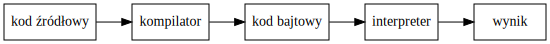

# Języki skryptowe - Python
## Wykład 6

---

* przestrzenie nazw
* moduły

## Nazwy zmiennych

---


```python
zmienna = 10 # zmienna wskazuje na int

print(zmienna)

zmienna = "Hello World!" # zmienna wskazuje na str

print(zmienna)

def funkcja():
    print("Jestem funkcją.")
    
zmienna = funkcja # zmienna wskazuje na funkcje

zmienna()
```

    10
    Hello World!
    Jestem funkcją.


## Niebezpieczne nadpisania

---


```python
def moja_nazwa(): # moja_nazwa wskazuje na funkcję
    print("Jestem funkcją.")
    
def moja_nazwa(): # moja_nazwa wskazuje inną funkcję
    print("Jestem nową funkcją.")
    
moja_nazwa()
```

    Jestem nową funkcją.


```python
moja_nazwa = 10 # moja_nazwa wskazuje na int 

moja_nazwa() # TypeError: 'int' object is not callable
```


    ---------------------------------------------------------------------------

    TypeError                                 Traceback (most recent call last)

    <ipython-input-3-d535b594ed2f> in <module>()
          1 moja_nazwa = 10 # moja_nazwa wskazuje na int
          2 
    ----> 3 moja_nazwa() # TypeError: 'int' object is not callable
    

    TypeError: 'int' object is not callable


## Moduły - *import* ...

---


```python
import math

def sin(x):
    """Zwraca x."""
    return x
```


```python
math.sin(math.pi / 2) # wywołanie [moduł].[funkcja]
```


    1.0


```python
sin(math.pi / 2) # wywołanie [funkcja]
```


    1.5707963267948966


## Moduły - *from ... import ...*

---


```python
from math import sin

def sin(x): # nadpisuje sin z math
    """Zwraca x."""
    return x

sin(math.pi / 2) # wywołanie funkcji sin
```


    1.5707963267948966


```python
def sin(x):
    """Zwraca x."""
    return x

from math import sin # nadpisuje sin

sin(math.pi / 2) # wywołanie math.sin
```


    1.0


## Przestrzenie nazw

---

* abstrakcyjna przestrzeń przechowująca nazwy
* np. przestrzeń nazw wbudowanych


```python
print(dir(__builtin__)[-72:])
```

    ['abs', 'all', 'any', 'ascii', 'bin', 'bool', 'bytearray', 'bytes', 'callable', 'chr', 'classmethod', 'compile', 'complex', 'copyright', 'credits', 'delattr', 'dict', 'dir', 'divmod', 'dreload', 'enumerate', 'eval', 'exec', 'filter', 'float', 'format', 'frozenset', 'get_ipython', 'getattr', 'globals', 'hasattr', 'hash', 'help', 'hex', 'id', 'input', 'int', 'isinstance', 'issubclass', 'iter', 'len', 'license', 'list', 'locals', 'map', 'max', 'memoryview', 'min', 'next', 'object', 'oct', 'open', 'ord', 'pow', 'print', 'property', 'range', 'repr', 'reversed', 'round', 'set', 'setattr', 'slice', 'sorted', 'staticmethod', 'str', 'sum', 'super', 'tuple', 'type', 'vars', 'zip']


## Uwaga: nadpisać można wszystko

---


```python
slownik = dict(x=1, y=2)

print(slownik)
```

    {'y': 2, 'x': 1}


```python
def dict(x, y): # nazwy wbudowane też można nadpisać
    return x, y

slownik = dict(x=1, y=2)

print(slownik)
```

    (1, 2)


```python
# usuń zmienne sesji jupyter
%reset
```

    Once deleted, variables cannot be recovered. Proceed (y/[n])? y


## Przestrzeń nazw lokalnych

---

* zmienne zdefiniowane wewnątrz funkcji (niedostępne poza nią)


```python
def funkcja():             # zmienne lokalne dostępne
    zmienna_lokalna = 1    # są tylko wewnątrz funkcji
    return zmienna_lokalna # w której zostały zdefiniowane

print("zmienna_lokalna =", zmienna_lokalna)
```


    ---------------------------------------------------------------------------

    NameError                                 Traceback (most recent call last)

    <ipython-input-13-7a69ba8766dd> in <module>()
          3     return zmienna_lokalna # w której zostały zdefiniowane
          4 
    ----> 5 print("zmienna_lokalna =", zmienna_lokalna)
    

    NameError: name 'zmienna_lokalna' is not defined


## Przestrzeń nazw globalnych

---

* dostępne w całym module (pliku)


```python
zmienna_globalna = "Python"

def funkcja():
    return zmienna_globalna

# wewnątrz funkcji zmienne globalne są dostępne
funkcja()
```


    'Python'


## Zmienne lokalne nadpisują globalne

---


```python
zmienna_globalna = "Python"

def funkcja():
    zmienna_globalna = "Nowy Python" # lokalna zmienna_globalna
    print("in funkcja:", zmienna_globalna)

funkcja()

print("outside funkcja:", zmienna_globalna) # globalna bez zmian
```

    in funkcja: Nowy Python
    outside funkcja: Python


## Albo *global* albo *local*

---


```python
zmienna_globalna = "Python"

def funkcja():
    print("in funkcja:", zmienna_globalna) # globalna?
    zmienna_globalna = "Nowy Python"
    print("in funkcja:", zmienna_globalna) # lokalna?

funkcja() # UnboundLocalError: local variable 'zmienna_globalna'
          # referenced before assignment
```


    ---------------------------------------------------------------------------

    UnboundLocalError                         Traceback (most recent call last)

    <ipython-input-16-c9f400fd03ff> in <module>()
          6     print("in funkcja:", zmienna_globalna) # lokalna?
          7 
    ----> 8 funkcja() # UnboundLocalError: local variable 'zmienna_globalna'
          9           # referenced before assignment


    <ipython-input-16-c9f400fd03ff> in funkcja()
          2 
          3 def funkcja():
    ----> 4     print("in funkcja:", zmienna_globalna) # globalna?
          5     zmienna_globalna = "Nowy Python"
          6     print("in funkcja:", zmienna_globalna) # lokalna?


    UnboundLocalError: local variable 'zmienna_globalna' referenced before assignment


## Kolejność przestrzeni

---

* nazwy lokalne, potem globalne, na końcu wbudowane


```python
list = tuple # zmienna globalna nadpisuje wbudowane list
dict = float # zmienna globalna nadpisuje wbudowane dict

print("type(list()) =", type(list()))
print("type(dict()) =", type(dict()))

def funkcja():
    dict = int # zmienna lokalna nadpisuje globalne dict
    print("In funkcja:")
    print("\ttype(dict()) =", type(dict())) # lokalna
    print("\ttype(list()) =", type(list())) # globalna
    print("\ttype(int()) =", type(int()))   # wbudowana

funkcja()
```

    type(list()) = <class 'tuple'>
    type(dict()) = <class 'float'>
    In funkcja:
    	type(dict()) = <class 'int'>
    	type(list()) = <class 'tuple'>
    	type(int()) = <class 'int'>


```python
%reset
```

    Once deleted, variables cannot be recovered. Proceed (y/[n])? y


## Wielokrotne zagnieżdżenie

---


```python
a = "global a" # zasięg zmiennych a, b, c
b = "global b" # jest globalny
c = "global c"

def funkcja():
    a = "local a" # lokalne a, b dostępne w funkcji
    b = "local b" # i w każdym kolejnym zagnieżdzeniu
    
    def funkcja_w_funkcji():
        a = "local local a" # dostępna tylko w funkcja_w_funkcji
        print(a, b, c, sep='\n')
    
    funkcja_w_funkcji()
    
funkcja() # od "najlokalniejszej" do "najglobalniejszej"
```

    local local a
    local b
    global c


## Uwaga na globalne mutowalne

---


```python
x = [1, 2, 3]
y = ['a', 'b', 'c']

def funkcja():
    x = [1, 2, 3, 4] # przypisanie -> zmienna lokalna
    y.append('d')    # modyfikacja -> ciągle globalna
    
funkcja()

print(x, y, sep='\n')
```

    [1, 2, 3]
    ['a', 'b', 'c', 'd']


## Wymuszanie zmiennej globalnej

---


```python
zmienna = "globalna"

def f():
    global zmienna # przypisanie nie tworzy zmiennej lokalnej
    zmienna = "nowa globalna" # ale modyfikuje globalną
    
f()

print(zmienna)
```

    nowa globalna


## Wymuszanie zmiennej "nielokalnej"

---


```python
a = "global a" # globalna

def f():
    a = "local a" # lokalna w f
    
    def g():
        a = "local local a" # lokalna w g
        print("in g():", a)
        
    g()
        
    print("in f():", a)

f()

print("outside:", a)
```

    in g(): local local a
    in f(): local a
    outside: global a


## Wymuszanie zmiennej "nielokalnej"

---


```python
a = "global a" # globalna

def f():
    a = "local a" # lokalna w f
    
    def g():
        global a # używaj globalnej
        a = "local local a" # modyfikuje globalną
        print("in g():", a)
        
    g()
        
    print("in f():", a)

f()

print("outside:", a)
```

    in g(): local local a
    in f(): local a
    outside: local local a


## Wymuszanie zmiennej "nielokalnej"

---


```python
a = "global a" # globalna

def f():
    a = "local a" # lokalna w f
    
    def g():
        nonlocal a # użyj a z poprzedniego zagnieżdżenia
        a = "local local a" # modyfikuje a z f
        print("in g():", a)
        
    g()
        
    print("in f():", a)

f()

print("outside:", a)
```

    in g(): local local a
    in f(): local local a
    outside: global a


## Uwaga dla programistów C/C++

---


```python
def funkcja(flag=True):
    if flag:   # zmienna zdefiniowana w bloku
        x = 10 # jest dostępna poza tym blokiem
    else:
        x = 20
        
    print(x)
```


```python
funkcja() 
```

    10


```python
funkcja(False)
```

    20


## Zasięg

---

* obszar dostępności danej przestrzeni nazw


```python
import math
from math import cos

a = 1 # zasięg -> cały plik

def f():
    # uwaga: zaleca się wszystkie importy robić na początku
    from math import log # zasięg log(...) -> funkcja
    b = 2 # zasięg -> funkcja
    c = log(3) 
    
d = math.sin(4) # sin(...) poza zasięgiem [moduł].[funkcja]
e = cos(5)      # zasięg cos(...) -> cały plik
# f = log(6)    # NameError: name 'log' is not defined
```

## Własny moduł

---


```python
%%writefile my_module.py
"""To jest mój pierwszy moduł."""

zmienna_globalna = "Unikaj zmiennych globalnych!"

def moja_funkcja():
    """Drukuje zmienną globalną."""
    print(zmienna_globalna)
    
def inna_funkcja(word="", n=0):
    """Drukuje word n razy."""
    print(word * n)
```

    Overwriting my_module.py


## Importowanie własnego modułu

---


```python
import my_module

my_module.zmienna_globalna
```


    'Unikaj zmiennych globalnych!'


```python
my_module.moja_funkcja()
```

    Unikaj zmiennych globalnych!


```python
my_module.inna_funkcja("-", 10)
```

    ----------


## Dokumentacja modułu

---


```python
import my_module

help(my_module)
```

    Help on module my_module:
    
    NAME
        my_module - To jest mój pierwszy moduł.
    
    FUNCTIONS
        inna_funkcja(word='', n=0)
            Drukuje word n razy.
        
        moja_funkcja()
            Drukuje zmienną globalną.
    
    DATA
        zmienna_globalna = 'Unikaj zmiennych globalnych!'
    
    FILE
        /doc/insync/scratch/zajęcia/2016/języki skryptowe - python/js-python/my_module.py
    
    


## Zawartość modułu

---


```python
import my_module

dir(my_module)
```


    ['__builtins__',
     '__cached__',
     '__doc__',
     '__file__',
     '__loader__',
     '__name__',
     '__package__',
     '__spec__',
     'inna_funkcja',
     'moja_funkcja',
     'zmienna_globalna']


## *doc*, *file*, *name*, *package*

---


```python
print(my_module.__doc__) # dokumentacja modułu
```

    To jest mój pierwszy moduł.


```python
print(my_module.__file__) # ścieżka do pliku źródłowego
```

    /doc/insync/scratch/zajęcia/2016/języki skryptowe - python/js-python/my_module.py


```python
print(my_module.__name__)  # nazwa modułu
```

    my_module


```python
print(my_module.__package__) # paczka to zbiór modułów
```

    


## *loader*, *spec*, *cached*

---


```python
# informacja o "loaderze", który został wykorzystany
# do zaimportowania modułu    
print(my_module.__loader__)
```

    <_frozen_importlib_external.SourceFileLoader object at 0x7f134aded6a0>


```python
print(my_module.__spec__) # ustalane w momencie importowanie modułu
```

    ModuleSpec(name='my_module', loader=<_frozen_importlib_external.SourceFileLoader object at 0x7f134aded6a0>, origin='/doc/insync/scratch/zajęcia/2016/języki skryptowe - python/js-python/my_module.py')


```python
print(my_module.__cached__) # ścieżka do pliku .pyc
```

    /doc/insync/scratch/zajęcia/2016/języki skryptowe - python/js-python/__pycache__/my_module.cpython-35.pyc


## Plik *pyc*

---

* plik *pyc* jest wynikiem kompilacji skryptu *py* do kodu bajtowego
* przyp. kod masyznowy -> zrozumiały dla procesora
* kod bajtowy -> zrozumiały dla maszyny wirtualnej / interpretera

## Kompilowany czy interpretowany?

---

* uwaga: implementacja języka (a nie język sam w sobie) może być kompilowany lub interpretowany


```python
from graphviz import Source

Source('digraph "interpreter" { rankdir=LR; node [shape="box", width=1]; \
        "kod źródłowy" -> "kompilator" -> "kod bajtowy" -> "interpreter" -> "wynik"}')
```





## Skrypt jako "zbior definicji"

---


```python
%%writefile my_module.py
"""To jest mój pierwszy moduł."""

zmienna_globalna = "Unikaj zmiennych globalnych!"

def moja_funkcja():
    """Drukuje zmienną globalną."""
    print(zmienna_globalna)
    
def inna_funkcja(word="", n=0):
    """Drukuje word n razy."""
    print(word * n)
```

    Overwriting my_module.py


```python
%run my_module.py
```

## Skrypt wykonujący operacje

---


```python
%%writefile my_module.py
"""To jest mój pierwszy moduł."""

zmienna_globalna = "Unikaj zmiennych globalnych!"

def moja_funkcja():
    """Drukuje zmienną globalną."""
    print(zmienna_globalna)
    
def inna_funkcja(word="", n=0):
    """Drukuje word n razy."""
    print(word * n)
    
inna_funkcja('-', 10)
moja_funkcja()
inna_funkcja('-', 10)
```

    Overwriting my_module.py


```python
%run my_module.py
```

    ----------
    Unikaj zmiennych globalnych!
    ----------


## Wykonywanie podczas importowania

---

```
Python 3.5.2 |Anaconda 4.2.0 (64-bit)| (default, Jul  2 2016, 17:53:06) 
[GCC 4.4.7 20120313 (Red Hat 4.4.7-1)] on linux
Type "help", "copyright", "credits" or "license" for more information.
>>> import my_module
----------
Unikaj zmiennych globalnych!
----------
>>> 
```

## "Funkcja *main*"

---


```python
%%writefile my_module.py
"""To jest mój pierwszy moduł."""

zmienna_globalna = "Unikaj zmiennych globalnych!"

def moja_funkcja():
    """Drukuje zmienną globalną."""
    print(zmienna_globalna)
    
def inna_funkcja(word="", n=0):
    """Drukuje word n razy."""
    print(word * n)

if __name__ == "__main__":
    inna_funkcja('-', 10)
    moja_funkcja()
    inna_funkcja('-', 10)
```

    Overwriting my_module.py


```python
%run my_module.py
```

    ----------
    Unikaj zmiennych globalnych!
    ----------


## Importowanie a *main*

---

* instrukcje w *main* nie zostaną wykonane podczas importowania (bo `__name__` = nazwa modułu)

```
Python 3.5.2 |Anaconda 4.2.0 (64-bit)| (default, Jul  2 2016, 17:53:06) 
[GCC 4.4.7 20120313 (Red Hat 4.4.7-1)] on linux
Type "help", "copyright", "credits" or "license" for more information.
>>> import my_module
>>> 
```

## Prywatność

---


```python
%%writefile private.py

public = "public"
# _ przed nazwą -> from ... import * pomija
_internal = "internal use"
```

    Overwriting private.py


```python
from private import * # importuj wszystko 
```


```python
public
```


    'public'


```python
_internal
```


    ---------------------------------------------------------------------------

    NameError                                 Traceback (most recent call last)

    <ipython-input-52-69fdfd559f34> in <module>()
    ----> 1 _internal
    

    NameError: name '_internal' is not defined


## Gdzie interpreter szuka modułów?

---

1. bieżący katalog
2. w katalogach określonych w zmiennej środowiskowej `PYTHONPATH`
3. w katalogach określonych w trakcie instalacji (np. `/usr/lib/python`)
4. w katalogach określonych w zmiennej `sys.path`

## Zmienne środowiskowe

---

* zmienne powłoki systemowej

```bash
goran@goran-ift:~$ export MOJA_ZMIENNA="wartość mojej zmiennej"
goran@goran-ift:~$ echo $MOJA_ZMIENNA 
wartość mojej zmiennej
```

* część zmiennych jest inicjowana przy starcie powłoki, np

```bash
goran@goran-ift:~$ echo $PATH
/home/goran/soft/anaconda3/bin:/usr/local/sbin:/usr/local/bin:/usr/sbin:/usr/bin:/sbin:/bin:/usr/games:/usr/local/games:/snap/bin
```

## Zmienne środowiskowe

---

* zmienne można aktualizować

```bash
goran@goran-ift:~$ export PATH=/newpath/:$PATH
goran@goran-ift:~$ echo $PATH
/newpath/:/home/goran/soft/anaconda3/bin:/usr/local/sbin:/usr/local/bin:/usr/sbin:/usr/bin:/sbin:/bin:/usr/games:/usr/local/games:/snap/bin
```

## *sys.path*

---


```python
import sys

sys.path
```


    ['',
     '/home/goran/soft/anaconda3/lib/python35.zip',
     '/home/goran/soft/anaconda3/lib/python3.5',
     '/home/goran/soft/anaconda3/lib/python3.5/plat-linux',
     '/home/goran/soft/anaconda3/lib/python3.5/lib-dynload',
     '/home/goran/soft/anaconda3/lib/python3.5/site-packages',
     '/home/goran/soft/anaconda3/lib/python3.5/site-packages/Sphinx-1.4.6-py3.5.egg',
     '/home/goran/soft/anaconda3/lib/python3.5/site-packages/setuptools-27.2.0-py3.5.egg',
     '/home/goran/soft/anaconda3/lib/python3.5/site-packages/IPython/extensions',
     '/home/goran/.ipython']


## *sys.path*

---


```python
sys.path.append("/moja/sciezka/do/modulow")

sys.path
```


    ['',
     '/home/goran/soft/anaconda3/lib/python35.zip',
     '/home/goran/soft/anaconda3/lib/python3.5',
     '/home/goran/soft/anaconda3/lib/python3.5/plat-linux',
     '/home/goran/soft/anaconda3/lib/python3.5/lib-dynload',
     '/home/goran/soft/anaconda3/lib/python3.5/site-packages',
     '/home/goran/soft/anaconda3/lib/python3.5/site-packages/Sphinx-1.4.6-py3.5.egg',
     '/home/goran/soft/anaconda3/lib/python3.5/site-packages/setuptools-27.2.0-py3.5.egg',
     '/home/goran/soft/anaconda3/lib/python3.5/site-packages/IPython/extensions',
     '/home/goran/.ipython',
     '/moja/sciezka/do/modulow']


## Moduł poza katalogiem roboczym

---


```python
%%writefile /home/goran/trojmian.py
"""Moduł do obsługi trómianu kwadratowego."""

from math import sqrt

def _delta(a, b, c):
    """Liczy wyróżnik trójmianu."""
    return b**2 - 4*a*c

def _solve(a, b, d):
    """Liczy miejsca zerowe."""
    d = sqrt(d)
    return (-b + d) / 2 / a, (-b - d) / 2 / a

def solution(a, b, c):
    """Zwraca miejsca zerowe."""
    d = _delta(a, b, c)
    
    if d < 0:return None
    elif d == 0: return -b / 2 / a
    else: return _solve(a, b, d) 
```

    Overwriting /home/goran/trojmian.py


## Moduł poza katalogiem roboczym

---


```python
# nie ma w katalogu roboczym ani w PYTHONPATH itd
import trojmian
```


    ---------------------------------------------------------------------------

    ImportError                               Traceback (most recent call last)

    <ipython-input-56-e2dca95631fe> in <module>()
          1 # nie ma w katalogu roboczym ani w PYTHONPATH itd
    ----> 2 import trojmian
    

    ImportError: No module named 'trojmian'


```python
import sys
sys.path.append("/home/goran/") # dodajemy ścieżkę do sys.path
import trojmian # teraz działa
```

## Trójmian w akcji

---


```python
help(trojmian) # nie ma _delta, ale jest sqrt!
```

    Help on module trojmian:
    
    NAME
        trojmian - Moduł do obsługi trómianu kwadratowego.
    
    FUNCTIONS
        solution(a, b, c)
            Zwraca miejsca zerowe.
        
        sqrt(...)
            sqrt(x)
            
            Return the square root of x.
    
    FILE
        /home/goran/trojmian.py
    
    


## Trójmian w akcji

---


```python
from trojmian import * # importuj wszystko
```


```python
solution(1, 2, 1) # dostęp do solution
```


    -1.0


```python
sqrt(4) # dostęp do sqrt z math!
```


    2.0


```python
_delta(1, 2, 1) # ale _delta nie została zaimportowana
```


    ---------------------------------------------------------------------------

    NameError                                 Traceback (most recent call last)

    <ipython-input-62-a5950f05b403> in <module>()
    ----> 1 _delta(1, 2, 1) # ale _delta nie została zaimportowana
    

    NameError: name '_delta' is not defined


## Paczka

---

* uporządkowany zbiór modułów

```
package_name/     # top-level
    __init__.py   # wymagane (może być puste)
    subpackage1/
        __init__.py
        module1.py
        module2.py
        ...
    subpackage2/
        __init__.py
        ...
``` 

## __init__.py

---


```python
%%writefile listy_zadan/__init__.py
"""Inicjalizacja paczki listy_zadan"""
import math # można np. importować moduły
```

    Overwriting listy_zadan/__init__.py


## Lista 4

---


```python
%%writefile listy_zadan/lista4/__init__.py
"""Inicjalizacja podpaczki lista4"""
```

    Overwriting listy_zadan/lista4/__init__.py


## Lista 4 - zadanie 2

---


```python
%%writefile listy_zadan/lista4/zad2.py
"""Napisz funkcję, która znajduje mniejszą liczbę z dwóch podanych."""

def min2(a, b):
    """Zwraca mniejszą z dwóch podanych liczb."""
    if a > b:
        return b
    return a
```

    Overwriting listy_zadan/lista4/zad2.py


## Lista 4 - zadanie 3

---


```python
%%writefile listy_zadan/lista4/zad3.py
"""Napisz funkcję, która z podanych liczb (ilość dowolna) znajduje najmniejszą."""

from listy_zadan.lista4.zad2 import min2

def min(*a):
    """Zwraca najmniejszą z podanych liczb."""
    current_min = a[0]
    
    for x in a:
        current_min = min2(current_min, x)
    
    return current_min
```

    Overwriting listy_zadan/lista4/zad3.py


## Importowanie

---


```python
import listy_zadan.lista4.zad2
import listy_zadan.lista4.zad3 as zad3

print("Zad2 =", listy_zadan.lista4.zad2.min2(1, 5))
print("Zad3 =", zad3.min(6, 2, 6, 3, 5))
```

    Zad2 = 1
    Zad3 = 2


```python
# css prezentacji


from IPython.display import display, HTML

s = """

<style>

.rendered_html code {
  font-size: 75%;
}

</style>

"""

display(HTML(s))
```


<style>

.rendered_html code {
  font-size: 75%;
}

</style>


